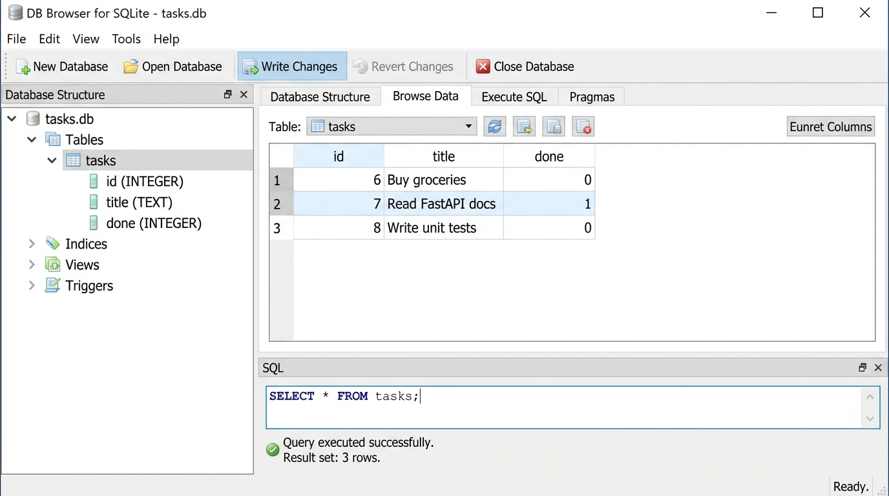

# Task API

A simple, production-style **CRUD REST API** for managing tasks, built with **Python 3.10+** and **FastAPI**.  
Data is stored in a **SQLite** database (`tasks.db`) using Python's built-in `sqlite3` module.

Built as the FlyRank Week 2 & 3 assignment.

---

## 📋 Requirements

| Requirement | Version |
|-------------|---------|
| Python | 3.10 or higher |
| FastAPI | 0.111.0 |
| Uvicorn | 0.30.1 |

> No additional database drivers needed — `sqlite3` is part of Python's standard library.

---

## ⚙️ Installation

```bash
# 1. Clone the repository
git clone https://github.com/i-saravanan/flyrank-task-api.git
cd flyrank-task-api

# 2. (Optional) Create a virtual environment
python -m venv venv
venv\Scripts\activate      # Windows
# source venv/bin/activate  # macOS / Linux

# 3. Install dependencies
pip install -r requirements.txt
```

---

## 🚀 Start the Server

```bash
python -m uvicorn main:app --host 127.0.0.1 --port 8000
```

The server starts at **http://127.0.0.1:8000**

On first run, the server automatically:
1. Creates `tasks.db` in the project directory
2. Creates the `tasks` table (if it doesn't exist)
3. Seeds 3 example tasks (only if the table is empty)

> **Deleting `tasks.db` and restarting** recreates everything automatically from scratch.

---

## 💾 Storage — Why SQLite?

| Feature | Detail |
|---------|--------|
| **Engine** | SQLite via Python's built-in `sqlite3` module |
| **File location** | `tasks.db` in the project root directory |
| **Persistence** | Data survives server restarts |
| **No setup needed** | No database server, no installation, no config |
| **Standard library** | Zero extra dependencies |

SQLite was chosen because:
- It requires **no external server or setup**
- It is **built into Python** (no pip install)
- It is **file-based** — `tasks.db` is portable and easy to inspect
- It is **persistent** — data survives server restarts (unlike the previous in-memory list)
- It is industry-standard for embedded/lightweight applications

---

## 🗄️ Database Schema

```sql
CREATE TABLE tasks (
    id    INTEGER PRIMARY KEY AUTOINCREMENT,
    title TEXT    NOT NULL,
    done  INTEGER NOT NULL DEFAULT 0
);
```

- `done` is stored as `0` (false) or `1` (true) — converted to JSON boolean automatically
- All queries use **parameterized SQL** (`?` placeholders) to prevent SQL injection

### Example SQL queries

```sql
-- List all tasks
SELECT * FROM tasks;

-- Filter completed tasks
SELECT * FROM tasks WHERE done = 1;

-- Count all tasks
SELECT COUNT(*) FROM tasks;

-- Mark all tasks done
UPDATE tasks SET done = 1;

-- Delete all completed tasks
DELETE FROM tasks WHERE done = 1;
```

---

## 📚 Swagger UI

FastAPI generates interactive API docs automatically.  
Open your browser and navigate to:

```
http://127.0.0.1:8000/docs
```

You can use **"Try it out"** on every endpoint to run a full CRUD cycle directly from the browser.

### Swagger UI Screenshot


---

## 🗄️ DB Browser for SQLite Screenshot

The `tasks.db` file can be opened and explored with [DB Browser for SQLite](https://sqlitebrowser.org/).



---

## 🗺️ Endpoint Table

| Method | Path | Description | Success Code |
|--------|------|-------------|--------------|
| `GET` | `/` | API name, version, and available endpoints | 200 |
| `GET` | `/health` | Server health check | 200 |
| `GET` | `/tasks` | List all tasks | 200 |
| `GET` | `/tasks/{id}` | Get a single task by ID | 200 |
| `POST` | `/tasks` | Create a new task | 201 |
| `PUT` | `/tasks/{id}` | Update a task's title and/or done status | 200 |
| `DELETE` | `/tasks/{id}` | Delete a task by ID | 204 |

---

## 📟 Expected HTTP Status Codes

| Code | Meaning |
|------|---------|
| `200 OK` | Successful GET or PUT |
| `201 Created` | Task successfully created via POST |
| `204 No Content` | Task successfully deleted via DELETE |
| `400 Bad Request` | Invalid or missing request body |
| `404 Not Found` | Task ID does not exist |

All errors are returned as **JSON**:
```json
{ "error": "Task not found" }
```

---

## 🧪 Example curl Commands

### List all tasks
```bash
curl http://127.0.0.1:8000/tasks
```
**Response (200):**
```json
[
  {"id": 1, "title": "Buy groceries", "done": false},
  {"id": 2, "title": "Read FastAPI docs", "done": true},
  {"id": 3, "title": "Write unit tests", "done": false}
]
```

### Create a task
```bash
curl -X POST http://127.0.0.1:8000/tasks \
  -H "Content-Type: application/json" \
  -d '{"title": "Buy milk"}'
```
**Response (201):**
```json
{"id": 4, "title": "Buy milk", "done": false}
```

### Update a task
```bash
curl -X PUT http://127.0.0.1:8000/tasks/1 \
  -H "Content-Type: application/json" \
  -d '{"done": true}'
```
**Response (200):**
```json
{"id": 1, "title": "Buy groceries", "done": true}
```

### Delete a task
```bash
curl -X DELETE http://127.0.0.1:8000/tasks/1
```
**Response: 204 No Content (empty body)**

### Unknown ID → 404
```bash
curl http://127.0.0.1:8000/tasks/999
```
**Response (404):**
```json
{"error": "Task not found"}
```

---

## 📁 Project Structure

```
flyrank-task-api/
├── main.py           # FastAPI application (all routes + SQLite storage)
├── requirements.txt  # Python dependencies
├── tasks.db          # SQLite database (auto-created, git-ignored)
├── docs/
│   ├── swagger-ui.png   # Swagger UI screenshot
│   └── db-browser.png   # DB Browser for SQLite screenshot
└── README.md         # This file
```

---

## 👤 Author

**Saravanan I** — saravanan05082004@gmail.com  
FlyRank Week 2 & 3 Assignment
