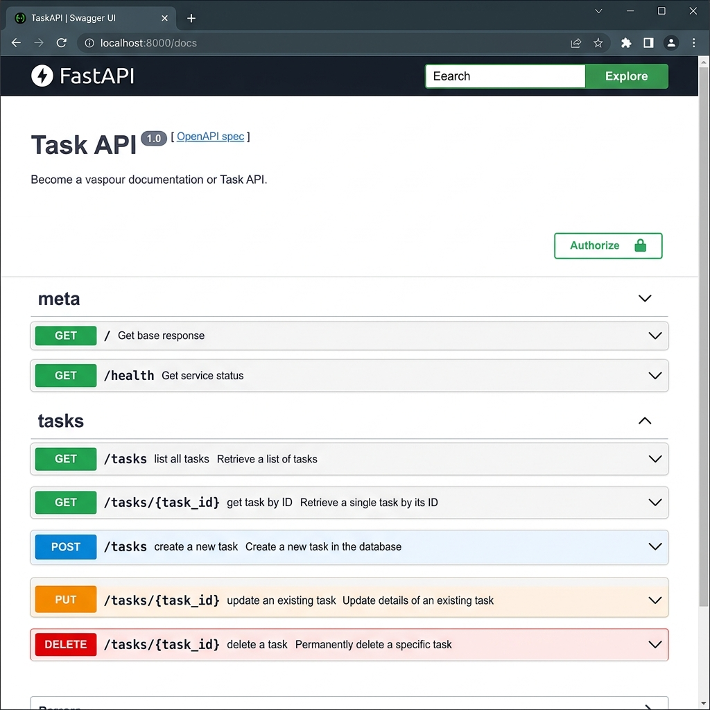

# Task API

A simple, production-style **CRUD REST API** for managing tasks, built with **Python 3.10+** and **FastAPI**.  
Built as the FlyRank Week 2 assignment — "Build your first CRUD API".

---

## 📋 Requirements

| Requirement | Version |
|-------------|---------|
| Python | 3.10 or higher |
| FastAPI | 0.111.0 |
| Uvicorn | 0.30.1 |

---

## ⚙️ Installation

```bash
# 1. Clone the repository
git clone https://github.com/saravanan05082004/flyrank-task-api.git
cd flyrank-task-api

# 2. (Optional) Create a virtual environment
python -m venv venv
venv\Scripts\activate      # Windows
# source venv/bin/activate  # macOS / Linux

# 3. Install dependencies
pip install -r requirements.txt
```

---

## 🚀 Start the Server

```bash
python -m uvicorn main:app --host 127.0.0.1 --port 8000
```

The server starts at **http://127.0.0.1:8000**

---

## 📚 Swagger UI

FastAPI generates interactive API docs automatically.  
Open your browser and navigate to:

```
http://127.0.0.1:8000/docs
```

You can use **"Try it out"** on every endpoint to run a full CRUD cycle directly from the browser.

### Swagger UI Screenshot


---

## 🗺️ Endpoint Table

| Method | Path | Description | Success Code |
|--------|------|-------------|--------------|
| `GET` | `/` | API name, version, and available endpoints | 200 |
| `GET` | `/health` | Server health check | 200 |
| `GET` | `/tasks` | List all tasks | 200 |
| `GET` | `/tasks/{id}` | Get a single task by ID | 200 |
| `POST` | `/tasks` | Create a new task | 201 |
| `PUT` | `/tasks/{id}` | Update a task's title and/or done status | 200 |
| `DELETE` | `/tasks/{id}` | Delete a task by ID | 204 |

---

## 📟 Expected HTTP Status Codes

| Code | Meaning |
|------|---------|
| `200 OK` | Successful GET or PUT |
| `201 Created` | Task successfully created via POST |
| `204 No Content` | Task successfully deleted via DELETE |
| `400 Bad Request` | Invalid or missing request body |
| `404 Not Found` | Task ID does not exist |

All errors are returned as **JSON**:
```json
{ "error": "Task 99 not found" }
```

---

## 🧪 Example curl Commands

### List all tasks
```bash
curl http://127.0.0.1:8000/tasks
```
**Response (200):**
```json
[
  {"id": 1, "title": "Buy groceries", "done": false},
  {"id": 2, "title": "Read FastAPI docs", "done": true},
  {"id": 3, "title": "Write unit tests", "done": false}
]
```

### Create a task
```bash
curl -X POST http://127.0.0.1:8000/tasks \
  -H "Content-Type: application/json" \
  -d '{"title": "Buy milk"}'
```
**Response (201):**
```json
{"id": 4, "title": "Buy milk", "done": false}
```

### Get a task
```bash
curl http://127.0.0.1:8000/tasks/1
```
**Response (200):**
```json
{"id": 1, "title": "Buy groceries", "done": false}
```

### Update a task
```bash
curl -X PUT http://127.0.0.1:8000/tasks/1 \
  -H "Content-Type: application/json" \
  -d '{"done": true}'
```
**Response (200):**
```json
{"id": 1, "title": "Buy groceries", "done": true}
```

### Delete a task
```bash
curl -X DELETE http://127.0.0.1:8000/tasks/1
```
**Response: 204 No Content (empty body)**

### Unknown ID → 404
```bash
curl http://127.0.0.1:8000/tasks/99
```
**Response (404):**
```json
{"error": "Task 99 not found"}
```

### Invalid body → 400
```bash
curl -X POST http://127.0.0.1:8000/tasks \
  -H "Content-Type: application/json" \
  -d '{"title": ""}'
```
**Response (400):**
```json
{"error": "Value error, title must not be empty"}
```

---

## 💾 Storage

> **In-memory only.** No database, no files, no external services.  
> All task data is stored in a Python list. Data is reset every time the server restarts.  
> This is intentional — the goal of this assignment is to practise API design, not persistence.

---

## 📁 Project Structure

```
flyrank-task-api/
├── main.py           # FastAPI application (all routes + models)
├── requirements.txt  # Python dependencies
└── README.md         # This file
```

---

## 👤 Author

**Saravanan I** — saravanan05082004@gmail.com  
FlyRank Week 2 Assignment
