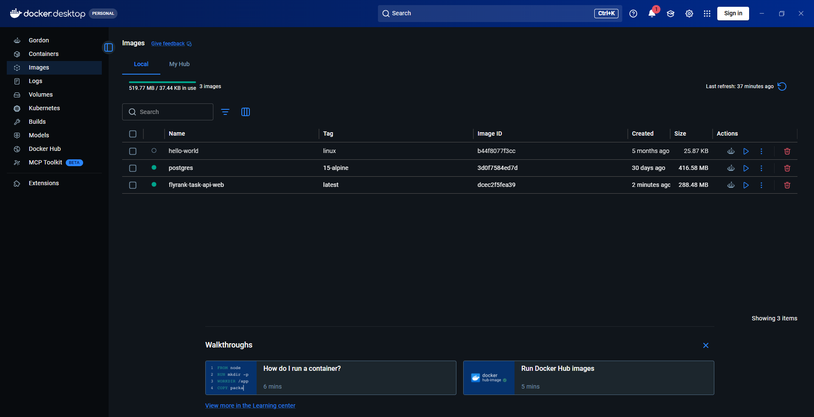

# Task API (Containerized)

A simple, production-style **CRUD REST API** for managing tasks, built with **Python 3.10+** and **FastAPI**.
In this version, the storage layer has been upgraded from SQLite to **PostgreSQL** running in a Docker container, containerized and orchestrated with **Docker Compose**.

---

## 🏗️ Architecture

```
[ Client (cURL / Browser) ]
            │
            ▼ (Port 8000)
┌─────────────────────────────────┐
│     FastAPI Application         │  <--- Running in Docker (tasks_web)
│  (main.py / uvicorn / psycopg2) │
└─────────────────────────────────┘
            │
            ▼ (Port 5432)
┌─────────────────────────────────┐
│      PostgreSQL Database        │  <--- Running in Docker (tasks_db)
│       (postgres:15-alpine)      │
└─────────────────────────────────┘
            │
            ▼ (Volume Mount)
┌─────────────────────────────────┐
│      Docker Persistent Volume   │  <--- Survives container restarts
│             (pg_data)           │
└─────────────────────────────────┘
```

---

## 💾 Storage — Why PostgreSQL replaced SQLite?

| SQLite (Previous) | PostgreSQL (Current) |
|---|---|
| Light, serverless database storing data in a local file (`tasks.db`). | Multi-user, production-ready relational database management system. |
| Limited concurrent write throughput. | High concurrency support, ideal for production workloads. |
| Embedded inside the host machine. | Isolated inside a separate Docker container, making the app stack independent. |
| Handled as plain integer flags (0/1) for booleans. | Native boolean fields (`TRUE`/`FALSE`) which match JSON specs. |

> **Note:** Only the repository storage layer was modified to use PostgreSQL with parameterized queries. The FastAPI endpoints, request schemas, response formats, status codes, and service layer validation logic remain **entirely unchanged**.

---

## ⚙️ Prerequisites

- **Docker** and **Docker Compose** installed on your system.
- (Optional for local development) **Python 3.10+**

---

## 🚀 One-Command Launch (Docker Compose)

The entire stack (FastAPI app + PostgreSQL database + persistent volume) can be launched with a single command.

### 1. Configure the Environment
Copy the example environment variables to create a `.env` file:
```bash
cp .env.example .env
```
*(Windows PowerShell)*:
```powershell
Copy-Item .env.example .env
```

### 2. Start the Stack
Run the following command to build the FastAPI image and start both services:
```bash
docker compose up -d --build
```

The server starts at **http://127.0.0.1:8000**

On startup, the system automatically:
1. Waits for PostgreSQL to become healthy.
2. Connects to PostgreSQL and executes `schema.sql` to create the `tasks` table if it is missing.
3. Seeds exactly three example tasks if the table is empty.

---

## 💾 Persistence Verification

The PostgreSQL database uses a persistent Docker volume (`pg_data`) mapped to `/var/lib/postgresql/data`. To verify that the tasks survive container restarts:

1. **Create a task**:
   ```bash
   curl -X POST http://127.0.0.1:8000/tasks -H "Content-Type: application/json" -d '{"title": "Verify Docker Volume"}'
   ```
2. **Restart the stack**:
   ```bash
   docker compose restart
   ```
3. **Verify it persists**:
   ```bash
   curl http://127.0.0.1:8000/tasks
   ```
   *The list will still include the "Verify Docker Volume" task.*

---

## 🗄️ Database Schema

`schema.sql` creates the schema automatically:
```sql
CREATE TABLE IF NOT EXISTS tasks (
    id SERIAL PRIMARY KEY,
    title VARCHAR(255) NOT NULL,
    done BOOLEAN NOT NULL DEFAULT FALSE
);
```

---

## 📚 Interactive Documentation (Swagger UI)

Navigate to:
```
http://127.0.0.1:8000/docs
```
You can use **"Try it out"** on every endpoint to run a full CRUD cycle directly from the browser.

### Docker Desktop Running Stack



### Swagger UI Screenshot


---

## 🗺️ Endpoint Table

| Method | Path | Description | Success Code |
|--------|------|-------------|--------------|
| `GET` | `/` | API name, version, and available endpoints | 200 |
| `GET` | `/health` | Server health check | 200 |
| `GET` | `/tasks` | List all tasks | 200 |
| `GET` | `/tasks/{id}` | Get a single task by ID | 200 |
| `POST` | `/tasks` | Create a new task | 201 |
| `PUT` | `/tasks/{id}` | Update a task's title and/or done status | 200 |
| `DELETE` | `/tasks/{id}` | Delete a task by ID | 204 |

---

## 📟 Expected HTTP Status Codes

| Code | Meaning |
|------|---------|
| `200 OK` | Successful GET or PUT |
| `201 Created` | Task successfully created via POST |
| `204 No Content` | Task successfully deleted via DELETE |
| `400 Bad Request` | Invalid or missing request body |
| `404 Not Found` | Task ID does not exist |

All errors are returned as **JSON**:
```json
{ "error": "Task not found" }
```

---

## 👤 Author

**Saravanan I** — saravanan05082004@gmail.com  
FlyRank Week 4 Assignment (BE-04)
